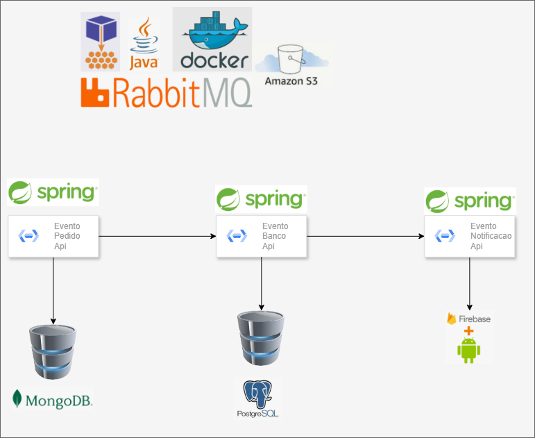

# events_microservice
Projeto para gerenciar o micro serviço de eventos da capoeira composto por uma 
Rest API que recebe a solicitação para adicionar novos eventos, uma api para transação com a base de dados e guardar todos os eventos ja registrados e um microserviço para notificar o android sobre eventos novos

Event API:
- Recebe uma solicitação via endpoint para adicionar no AWS S3
- Faz a solicitação para adicionar um novo event
- Realização uma solicitação para enviar todos eventos para o android/client

Processor Api:
- Atraves de uma fila do rabbitMQ faz a adição na base de dados de um novo event
- Atraves de uma fila faz o envio dos eventos para os clients

Notificacao API:
- Essa API recebe um pedido de um ou mais eventos como payload e se comunica com os clients/android para notifica-los

# Visando geral do projeto

# Visando geral das filas do RabbitMQ

# Para executar o projeto execute:
docker compose up --build -d

# Para testar os endpoints acesse:
http://localhost:3000/swagger-ui/index.html

# Para checkar as filas no rabbitmq acesse:
http://localhost:15672/
username: rabbitmq
password: rabbitmq
