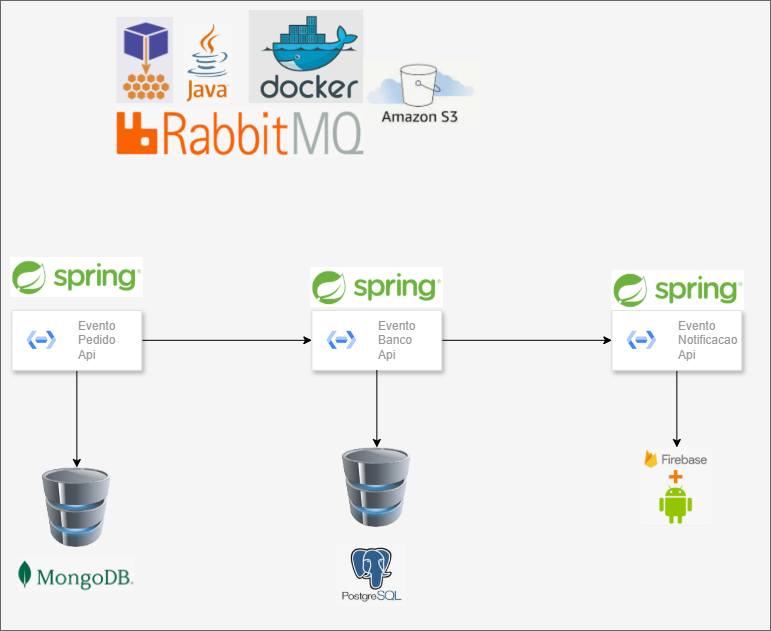

# events_microservice

This project is an event-driven microservices architecture designed to manage Capoeira events.

It is composed of multiple Spring Boot services that communicate asynchronously using RabbitMQ, and integrate with external services such as AWS S3 and Firebase.

---

## 🧩 Architecture Overview

The system is composed of the following microservices:

---

### 👤 User API (Authentication Service)

* Responsible for user management and authentication
* Generates JWT tokens used across the system
* Defines user roles (e.g., `ADMIN`, `CLIENT`)
* Injects claims into JWT:

    * `roles`
    * `userId`
    * `organizationId` (optional)

🔐 This API is the **entry point for authentication**

---

### 📌 Event API

* Receives requests via REST endpoints to create new events
* Uploads event-related data (e.g., images) to AWS S3
* Sends messages to RabbitMQ to trigger event processing
* Can request all events to be sent to clients (Android)

---

### ⚙️ Processor API (Event Database API)

* Consumes messages from RabbitMQ
* Persists events into PostgreSQL
* Publishes messages to notify clients about new or updated events

---

### 🔔 Notification API

* Receives event payloads
* Sends push notifications to Android clients using Firebase (FCM)

> ⚠️ If running locally via IntelliJ, you may need to add VM options:

```
--add-opens java.base/java.time.chrono=ALL-UNNAMED
--add-opens java.base/java.time.format=ALL-UNNAMED
--add-opens java.base/java.time.temporal=ALL-UNNAMED
--add-opens java.base/java.time.zone=ALL-UNNAMED
```

---

### 🏢 Organization API

* Manages organizations and their units (e.g., Capoeira groups)
* Provides CRUD operations
* Uses PostgreSQL as its data source
* Protected by JWT authentication
* Uses role-based authorization:

    * `ADMIN` → create/update organizations and units
    * `CLIENT` → read-only access

---

## 🔐 Authentication & Authorization

Authentication is centralized in the **User API**, while authorization is enforced across services.

### 🔑 JWT Example

```json
{
  "sub": "user@email.com",
  "roles": ["ADMIN"],
  "userId": 1,
  "organizationId": 10
}
```

### 🔄 Security Flow

1. Client authenticates via **User API**
2. Receives JWT token
3. Sends token in requests:

```
Authorization: Bearer <token>
```

4. Other APIs validate the token
5. Access is controlled via roles (`@PreAuthorize`)

---

## 📡 Example Requests

### 🔐 Login (User API)

```bash
curl -X POST http://localhost:8082/api/v1/auth/login \
  -H "Content-Type: application/json" \
  -d '{
    "email": "admin@test.com",
    "password": "123456"
  }'
```

Response:

```json
{
  "token": "eyJhbGciOiJIUzI1NiIsInR5cCI6IkpXVCJ9..."
}
```

---

### 🏢 Create Organization (ADMIN only)

```bash
curl -X POST http://localhost:8081/api/v1/organizacao \
  -H "Authorization: Bearer <token>" \
  -H "Content-Type: application/json" \
  -d '{
    "name": "Capoeira Bonfim",
    "slug": "bonfim",
    "description": "Grupo de capoeira",
    "logoUrl": "http://image.com/logo.png",
    "active": true,
    "mainUnit": {
      "name": "Matriz",
      "city": "São Paulo",
      "country": "Brasil"
    }
  }'
```

---

### 📖 Get Organization (Authenticated)

```bash
curl -X GET http://localhost:8081/api/v1/organizacao/1 \
  -H "Authorization: Bearer <token>"
```

---

### ❌ Forbidden Example (CLIENT trying ADMIN endpoint)

Response:

```json
{
  "status": 403,
  "error": "Forbidden"
}
```

---

## 🗄️ Databases

* **MongoDB** → Event API
* **PostgreSQL** → Processor API & Organization API
* **AWS S3** → File storage

---

## 🔄 Messaging

* RabbitMQ is used for asynchronous communication
* Enables decoupling and scalability

---

## 📊 Architecture Diagram



---

## 📨 RabbitMQ Flow


---

## ▶️ Running the Project

```bash
docker compose up --build -d
```

---

## 🌐 API Documentation (Swagger)

* Event API
  http://localhost:8080/swagger-ui/index.html

* Organization API
  http://localhost:8081/swagger-ui/index.html

* User API
  http://localhost:8082/swagger-ui/index.html

---

## 🐇 RabbitMQ Management

http://localhost:15672/

Credentials:

* username: rabbitmq
* password: rabbitmq

---

## 🧠 Tech Stack

* Java / Spring Boot
* Spring Security (JWT)
* Docker / Docker Compose
* RabbitMQ
* PostgreSQL
* MongoDB
* AWS S3
* Firebase Cloud Messaging (FCM)

---

## 📌 Notes

* Each microservice has its own database
* Communication is asynchronous via RabbitMQ
* Authentication is centralized (User API)
* Authorization is role-based (JWT)
* Designed for scalability and decoupling

---

## 🚀 Future Improvements

* API Gateway (Spring Cloud Gateway)
* Centralized logging (ELK / Grafana)
* Observability (OpenTelemetry)
* CI/CD pipeline
* Rate limiting & security hardening

---

## 👨‍💻 Author

Ricardo Rodrigues Alves
Backend Developer | Java | Microservices | Android

---
