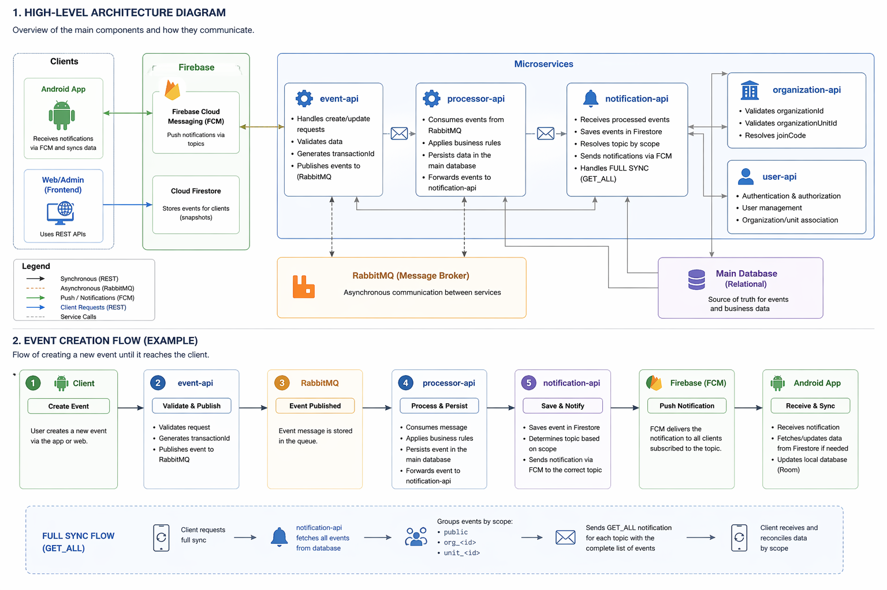

# 🧩 Event Manager - Architecture Overview

## 📌 System Purpose

Event Manager is a platform designed to manage and distribute events (e.g., capoeira events), enabling:

* Event creation and updates
* Segmented distribution by organization and unit
* Data synchronization between backend and client applications
* Real-time notifications using Firebase

---

## 🏗️ High-Level Architecture

The system is built using a microservices architecture with asynchronous communication and push-based data delivery.

## 🏗️ Architecture Diagram

The following diagram provides a high-level overview of the system components and how they interact.

### Main Components:

* **event-api**
* **processor-api**
* **notification-api**
* **organization-api**
* **user-api**
* **Android App**
* **Firebase (Firestore + FCM)**
* **RabbitMQ**

---

## 🔧 Microservices Responsibilities

### 📍 event-api

Responsible for handling incoming requests.

* Receives REST requests (create/update)
* Performs initial validations
* Generates `transactionId`
* Publishes events to RabbitMQ

---

### ⚙️ processor-api

Responsible for processing and persistence.

* Consumes messages from RabbitMQ
* Applies business rules
* Persists data into the main database
* Forwards events to notification-api

---

### 🔔 notification-api

Responsible for event distribution.

* Persists events in Firestore
* Resolves target topic based on `scope`
* Sends notifications via Firebase Cloud Messaging (FCM)

---

### 🏢 organization-api

Responsible for organizational structure.

* Validates `organizationId`
* Validates `organizationUnitId`
* Resolves `joinCode`

---

### 👤 user-api

Responsible for user management and authentication.

* User registration and authentication
* Organization and unit association
* Access control

---

## 📡 Inter-Service Communication

### 🔁 Asynchronous (Primary)

* RabbitMQ
* Communication flow:

    * event-api → processor-api
    * processor-api → notification-api

### 🌐 Synchronous

* REST APIs (e.g., organization validation)

---

## 🔔 Notification System

The system uses Firebase Cloud Messaging (FCM) with topic-based segmentation.

### 📌 Topic Structure

| Type         | Topic                       |
| ------------ | --------------------------- |
| Public       | `public`                    |
| Organization | `org_<organizationId>`      |
| Unit         | `unit_<organizationUnitId>` |

---

## 🎯 Delivery Rules

A user receives events based on subscribed topics.

### Example:

User belongs to organization `1` and unit `10`

Receives:

* `public`
* `org_1`
* `unit_10`

Does NOT receive:

* other organizations
* other units

---

## 🔄 Data Synchronization

### Strategy: Eventual Consistency + Full Sync

The system uses real-time updates combined with a reconciliation mechanism.

### Update Types:

#### 1. Incremental Updates

* CREATE
* UPDATE

#### 2. Full Sync (GET_ALL)

* Sends complete dataset
* Used to fix inconsistencies between client and server

---

## 📦 Payload Structure

All events contain:

* `transactionId`
* `scope`
* `organizationId`
* `organizationUnitId`

### Scope:

| Type         | Description              |
| ------------ | ------------------------ |
| PUBLIC       | Global event             |
| ORGANIZATION | Organization-level event |
| UNIT         | Unit-level event         |

---

## 🔁 Simplified Flow

### Event Creation Flow

1. Client → event-api
2. event-api validates and publishes to RabbitMQ
3. processor-api consumes and persists
4. notification-api receives event
5. notification-api saves to Firestore
6. notification-api sends notification to the correct topic

---

### Full Synchronization Flow (GET_ALL)

1. notification-api receives full event list
2. Events are grouped by `scope`
3. Notifications are sent:

    * public → `public`
    * by organization → `org_X`
    * by unit → `unit_Y`
4. Client reconciles local data by scope

---

## 📱 Client (Android)

* Subscribes to multiple topics
* Receives events via FCM
* Persists data locally (Room)
* Performs scoped reconciliation during full sync

---

## ⚠️ Important Assumptions

* FCM is used for distribution, not authorization
* Security must be enforced on the backend
* Clients must not rely solely on topic subscription for data access
* Backend guarantees data isolation between organizations

---

## 🚀 Scalability

The architecture supports:

* Multiple organizations
* Multiple units per organization
* Horizontal user scaling
* High-volume notification delivery via topics

---

## 📚 Next Documents

* event-api.md
* notification-api.md
* full-sync-flow.md
* integration-contracts.md

---
