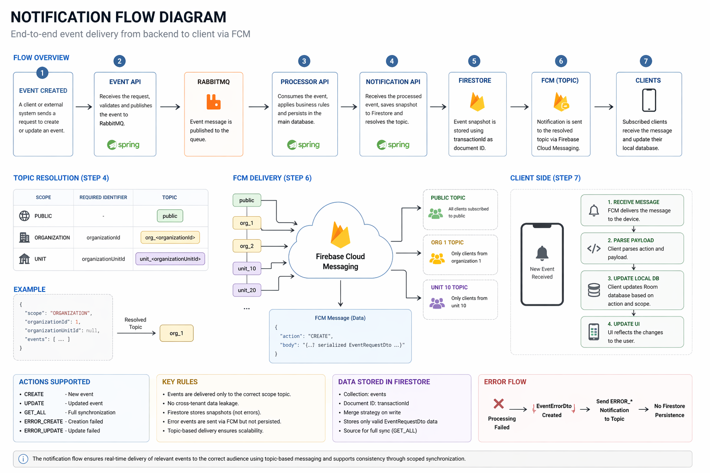

## 📊 Notification Flow Diagram

The diagram below represents the end-to-end notification flow, from event creation to client delivery.

It illustrates how events move across the system and how they are distributed using Firebase Cloud Messaging (FCM).

---

### Overview

The notification flow follows a distributed, event-driven architecture:

1. The **event-api** receives and validates the request
2. The event is published to **RabbitMQ**
3. The **processor-api** consumes and persists the event
4. The **notification-api** receives the processed event
5. The event is stored in **Firestore**
6. A topic is resolved based on the event scope
7. A notification is sent via **FCM**
8. Subscribed clients receive and process the event

---

### Key Concepts Illustrated

#### 1. Topic-Based Distribution

The diagram highlights how events are routed using topics:

* `public` → all users
* `org_<organizationId>` → specific organization
* `unit_<organizationUnitId>` → specific unit

This ensures scalability and proper data segmentation.

---

#### 2. Scope Isolation

Each event is delivered only to its intended audience.

There is no cross-organization or cross-unit data sharing, ensuring:

* tenant isolation
* data privacy
* correct delivery behavior

---

#### 3. Firestore as Snapshot Layer

Firestore is used as a synchronized data layer:

* Stores event snapshots
* Supports new device initialization
* Provides data for external consumers

It is not the source of truth, but a **read-optimized layer**.

---

#### 4. Real-Time Delivery via FCM

The system uses Firebase Cloud Messaging to:

* deliver events in real time
* avoid polling strategies
* scale efficiently using topics

---

#### 5. Client-Side Processing

On the client side:

* The message is received via FCM
* The payload is parsed
* The local database (Room) is updated
* The UI reflects the new state

---

#### 6. Error Flow

The diagram also represents error scenarios:

* Failed operations generate an `EventErrorDto`
* Errors are sent via FCM
* No Firestore persistence occurs

---

### Why This Design Matters

This flow enables:

* scalable event distribution
* efficient multi-tenant isolation
* real-time updates
* recovery via full sync (GET_ALL)
* reduced backend load using topic-based messaging

---

### Diagram Placement

Place the diagram right below this section in the document:

---

### Summary

The diagram provides a visual representation of how the system:

* processes events
* distributes them efficiently
* ensures correct delivery
* maintains consistency across devices

It complements the detailed flow description by illustrating the architecture in a clear and intuitive way.

---
